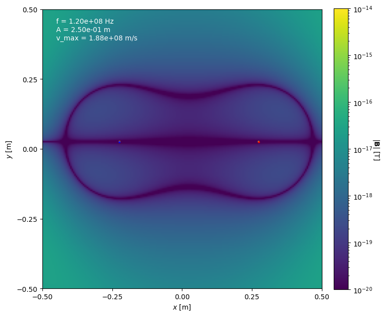

# Radiation By Moving Charges

This is set of Python programs designed to simulate electromagnetic radiation
produced by different configurations of moving point charges.
All those programs are complementary parts to the chapters in the article
"Radiation From Moving Charges" which is also attached to this repo.

Charge configurations which are covered by the article and python program are:
- Charge moving with arbitrary velocity
- Charge moving with constant velocity
- Charge moving with constant angular velocity
- Oscillating single charge
- Oscillating electric dipole

